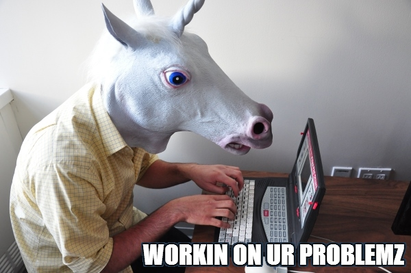

# INFO 201 AB Final Project 
## Introduction
**Best Bank Of 2017** is a ShinyApp Interface produced by Zegang Cheng, Nathan Magdalera, Tufang Xu, and Shelley Tsui.

 

#### This Shiny App utilizes the Jambase API in order to create an interactive map. The map displays the locations of an artist/band/concert information based on user input. Users can click on individual map markers to learn more information about the concert venue's location.

### Work Assigned

| Name        | Responsibilities |           
| ------------- |:-------------:| 
| Shelley Tsui      | Shiny Interface Design, Page Feature Editing, Code Checknig | 
| Zegang Chang     |  Map Visualization, Major Code Merging & Editing       |  
| Nathan Magdalera  | Data Extraction, Jambase API Control, Dataset Management    |    
| Tufang Xu (Coco) | Shiny Interface Widge Design, Introduction & Markdown Editing, Code Checking |

#### A normal day for us....

